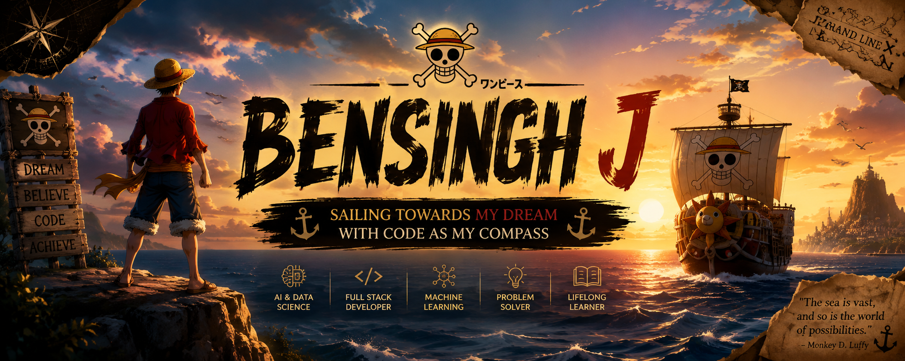
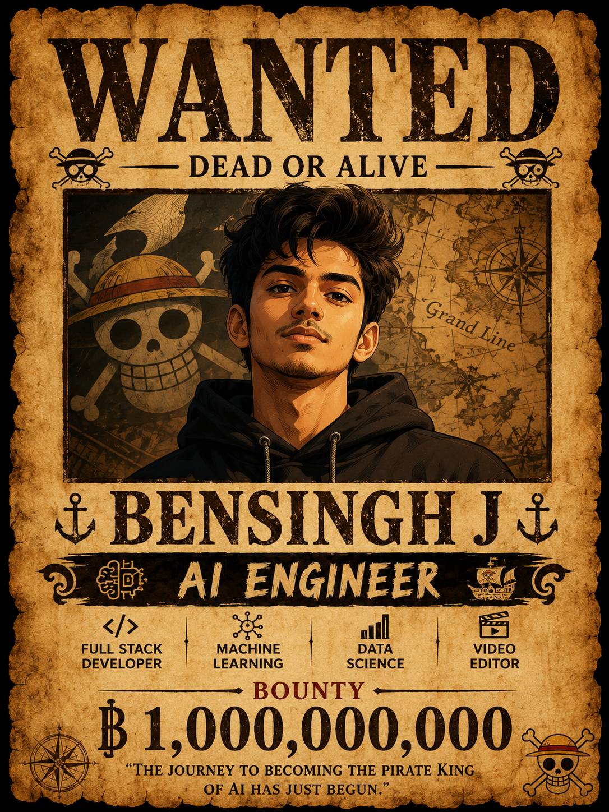

<div align="center">



<br/>


<br/><br/>

[](https://github.com/bensinghj23)
[](https://linkedin.com/in/bensingh-j-7a6a06327)
[](mailto:bensinghj23@gmail.com)


</div>

<br/>

<div align="center">

### 🧭 &nbsp; [Captain](#-meet-the-captain) &nbsp;•&nbsp; [Arsenal](#%EF%B8%8F-devil-fruit-powers) &nbsp;•&nbsp; [Journey](#-grand-line-journey) &nbsp;•&nbsp; [Treasure](#-treasure-chest) &nbsp;•&nbsp; [Studio](#-pirates-creative-studio) &nbsp;•&nbsp; [Stats](#-bounty-board) &nbsp;•&nbsp; [Crew](#-join-my-crew)

</div>

<br/>

---

<br/>

## ⚓ &nbsp; Meet the Captain

<table border="0">
<tr>
<td width="62%" valign="top">

Ahoy! I'm **Bensingh J** — an **AI & Data Science student** who treats every project like a new island on the map: something worth exploring, breaking, and rebuilding better.

I like turning ideas into working software — AI-powered apps, full-stack platforms, and interfaces people actually enjoy using. Outside of code, I edit video, design thumbnails, and shape UI/UX, because I think technical skill and creative instinct make each other stronger.

Long-term, I'm sailing toward one goal: becoming an **AI Engineer** who ships technology that genuinely helps people, at a company that lets me do it at scale.

**Right now, I'm charting a course through:**

- 🤖 &nbsp; Becoming an AI Engineer, one project at a time
- 🧠 &nbsp; Getting fluent in Machine Learning
- 💻 &nbsp; Shipping scalable full-stack applications
- 🎬 &nbsp; Sharpening video editing & creative design
- 🚀 &nbsp; Contributing to open source
- 🌍 &nbsp; Building tech that makes a real difference

</td>
<td width="38%" valign="top" align="center">



<br/><br/>

<table>
<tr><td align="center">

**DEAD OR ALIVE**
### BENSINGH J
🤖 AI Engineer &nbsp;|&nbsp; 💻 Full Stack Dev
🧠 ML Enthusiast &nbsp;|&nbsp; 🎬 Video Editor

**💰 BOUNTY: ฿ 1,000,000,000**

*"Every line of code is another step toward the One Piece of Technology."*

</td></tr>
</table>

</td>
</tr>
</table>

<br/>

> ### 🌊 Captain's Philosophy
> *"Dream big. Learn continuously. Build fearlessly. Every challenge is another island waiting to be explored."*
>
> Technology is an endless ocean of possibilities. My mission is to combine **Artificial Intelligence**, **Machine Learning**, **Software Engineering**, and **Creative Design** into products that improve people's lives — because the strongest developers are the ones who never stop learning.

<br/>

---

<br/>

## ⚔️ &nbsp; Devil Fruit Powers

<div align="center">

*"Power isn't given. It's earned through curiosity, consistency, and continuous learning."*

<br/>


</div>

<br/>

<table width="100%">
<tr>
<td width="50%" valign="top">

### 🤖 &nbsp; AI & Data Science
&nbsp;&nbsp;🧠 &nbsp; Machine Learning
&nbsp;&nbsp;🐼 &nbsp; Pandas
&nbsp;&nbsp;🔢 &nbsp; NumPy
&nbsp;&nbsp;📊 &nbsp; Data Analysis
&nbsp;&nbsp;📈 &nbsp; Data Visualization

</td>
<td width="50%" valign="top">

### 🐍 &nbsp; Programming Languages
&nbsp;&nbsp;🐍 &nbsp; Python
&nbsp;&nbsp;⚡ &nbsp; JavaScript

</td>
</tr>
<tr>
<td width="50%" valign="top">

### 🌐 &nbsp; Frontend Development
&nbsp;&nbsp;🌍 &nbsp; HTML5
&nbsp;&nbsp;🎨 &nbsp; CSS3
&nbsp;&nbsp;⚛️ &nbsp; React
&nbsp;&nbsp;🅱️ &nbsp; Bootstrap

</td>
<td width="50%" valign="top">

### ⚙️ &nbsp; Backend Development
&nbsp;&nbsp;🔥 &nbsp; Firebase
&nbsp;&nbsp;🟢 &nbsp; Node.js

</td>
</tr>
<tr>
<td width="50%" valign="top">

### 🗄️ &nbsp; Databases
&nbsp;&nbsp;🐬 &nbsp; MySQL
&nbsp;&nbsp;🍃 &nbsp; MongoDB

</td>
<td width="50%" valign="top">

### 🛠️ &nbsp; Tools
&nbsp;&nbsp;🔧 &nbsp; Git &nbsp;•&nbsp; GitHub
&nbsp;&nbsp;💻 &nbsp; VS Code
&nbsp;&nbsp;🎨 &nbsp; Canva

</td>
</tr>
</table>

<br/>

---

<br/>

## 🗺️ &nbsp; Grand Line Journey

<div align="center">

| 📍 Destination | ⚓ Achievement |
|:---|:---|
| 🎓 **St. Xavier's Catholic College of Engineering** | B.Tech — Artificial Intelligence & Data Science |
| ☕ **White Aura X** | Java Master Internship |
| 💻 **AK Infopark** | Full Stack Development Internship |
| 🚀 **Current Voyage** | AI • Machine Learning • React • Firebase • Video Editing |

</div>

<br/>

<table width="100%">
<tr>
<td width="50%" valign="top">

### ⚔️ Java Master Internship
📍 *White Aura X*

**Learned:** Core Java, OOP, Collections, Exception Handling, Java Projects, Problem Solving

</td>
<td width="50%" valign="top">

### 🌐 Full Stack Internship
📍 *AK Infopark*

**Learned:** HTML, CSS, JavaScript, React, Responsive Web Design, Backend Basics

</td>
</tr>
</table>

<br/>

### 📚 Currently Learning

<div align="center">

| 🤖 AI | 🧠 ML | ⚛️ React | 🔥 Firebase | 🎬 Video Editing | 🎨 UI/UX |
|:---:|:---:|:---:|:---:|:---:|:---:|
| Building intelligent systems | Algorithms & predictive models | Modern frontend apps | Auth, Firestore & Hosting | Creative storytelling & motion | Modern user experiences |

</div>

<br/>

### 🗺️ Current Quest Progress

```text
🎯 Artificial Intelligence     ██████████████░░░░░░  70%
💻 Full Stack Development      ████████████████░░░░  80%
🧠 Machine Learning            ████████████░░░░░░░░  60%
🎬 Video Editing                ███████████████░░░░░  75%
🎨 UI / UX Design               █████████████░░░░░░░  65%
```

<br/>

---

<br/>

## 💰 &nbsp; Treasure Chest

<div align="center">

*"Every project is a treasure earned through curiosity, persistence, and countless lines of code."*

</div>

<br/>

<table width="100%">
<tr>
<td width="50%" valign="top">

### 💳 Billing Management System
🟢 **Completed**

A modern billing and inventory management app that simplifies product management, invoicing, GST calculations, and customer billing.

**Stack:** `Java` `MySQL`

**Highlights:** Inventory Management • Invoice Generation • GST Calculation • Sales Tracking • Product Search • Stock Updates

</td>
<td width="50%" valign="top">

### 🏴‍☠️ One Piece Interactive Website
🟡 **In Progress**

An immersive anime-inspired web experience with cinematic scrolling, modern UI animations, and a Straw Hat Pirates showcase.

**Stack:** `HTML` `CSS` `JavaScript`

**Highlights:** Cinematic Scrolling • Animated Sections • Character Cards • Responsive Design • Smooth Animations

</td>
</tr>
<tr>
<td width="50%" valign="top">

### 🤖 AI Mini Projects
🟢 **Ongoing**

A collection of AI and Machine Learning experiments exploring predictive models, automation, and data analysis.

**Stack:** `Python` `Machine Learning` `Pandas` `NumPy`

**Highlights:** Data Analysis • Machine Learning • Prediction Models • AI Experiments

</td>
<td width="50%" valign="top">

### 🌐 Portfolio Website
🟡 **Improving**

A modern portfolio showcasing projects, skills, and achievements with responsive, interactive UI.

**Stack:** `React` `CSS`

**Highlights:** Responsive Layout • Modern UI • Fast Performance • Project Showcase

</td>
</tr>
</table>

<br/>

### 🚀 Upcoming Adventures

<table width="100%">
<tr>
<td width="34%" valign="top">

**🔥 AI-Powered ERP System**
Intelligent ERP platform with inventory, billing, analytics, auth, and cloud sync.
`React` `Firebase` `Machine Learning`

</td>
<td width="33%" valign="top">

**🤖 AI Assistant**
Smart assistant for productivity, automation, and intelligent recommendations.

</td>
<td width="33%" valign="top">

**🌐 Portfolio V2**
Cinematic One Piece-inspired portfolio with 3D animation & premium UI.

</td>
</tr>
</table>

<br/>

---

<br/>

## 🎬 &nbsp; Pirate's Creative Studio

<div align="center">

*Technology meets creativity.*

<br/>

<table width="100%">
<tr>
<td align="center" width="20%">🎥<br/><b>Video Editing</b><br/><sub>Cinematic storytelling & smooth transitions</sub></td>
<td align="center" width="20%">📸<br/><b>Photo Editing</b><br/><sub>Enhancing visuals for digital media</sub></td>
<td align="center" width="20%">🖼️<br/><b>Thumbnail Design</b><br/><sub>Eye-catching thumbnails that drive clicks</sub></td>
<td align="center" width="20%">🎨<br/><b>UI / UX Design</b><br/><sub>Clean, modern, user-friendly interfaces</sub></td>
<td align="center" width="20%">📱<br/><b>Content Creation</b><br/><sub>Meaningful digital experiences</sub></td>
</tr>
</table>

</div>

<br/>

---

<br/>

## 🏆 &nbsp; Pirate Achievements &nbsp;&nbsp;·&nbsp;&nbsp; 📜 Certifications

<table width="100%">
<tr>
<td width="50%" valign="top">

- 🥇 Java Master Internship
- 🥇 Full Stack Development Internship
- 🥇 AI & Data Science Student
- 🥇 Multiple Real-World Projects
- 🥇 Creative Video Editor
- 🥇 Passionate Lifelong Learner

</td>
<td width="50%" valign="top">

- ✅ Java Master Program
- ✅ Full Stack Development Internship
- 🔄 More certifications coming soon...

</td>
</tr>
</table>

<br/>

---

<br/>

## 📊 &nbsp; Bounty Board

<div align="center">

*"Every contribution is another step toward the Grand Line of Technology."*

<br/><br/>


<br/><br/>


<br/><br/>


<br/><br/>


</div>

<br/>

---

<br/>

## 🌊 &nbsp; Beyond Coding

<div align="center">

🎬 Video Editing &nbsp;•&nbsp; 📸 Photo Editing &nbsp;•&nbsp; 🎨 UI/UX Design &nbsp;•&nbsp; 🖼️ Thumbnail Design &nbsp;•&nbsp; 📱 Content Creation &nbsp;•&nbsp; 🏴‍☠️ Watching Anime &nbsp;•&nbsp; 📚 Learning New Tech

</div>

<br/>

---

<br/>

## ⚓ &nbsp; Join My Crew

<div align="center">

I'm always up for a good conversation about AI, code, or the next big idea — reach out anytime.

<br/>

[](mailto:bensinghj23@gmail.com)
[](https://linkedin.com/in/bensingh-j-7a6a06327)
[](https://github.com/bensinghj23)

<br/><br/>

> *"Dream big. Learn continuously. Build fearlessly."*
>
> Technology is an endless ocean of possibilities. Every project teaches something new. Every bug solved makes me stronger. Every challenge is another island waiting to be explored.
>
> I'm sailing toward becoming an AI Engineer who builds products that create real impact.

<br/>


### 🏴‍☠️ Thank You for Visiting My Ship ⚓

⭐ If you enjoyed my projects, consider following me on GitHub!
🚀 Let's build something amazing together.


</div>
